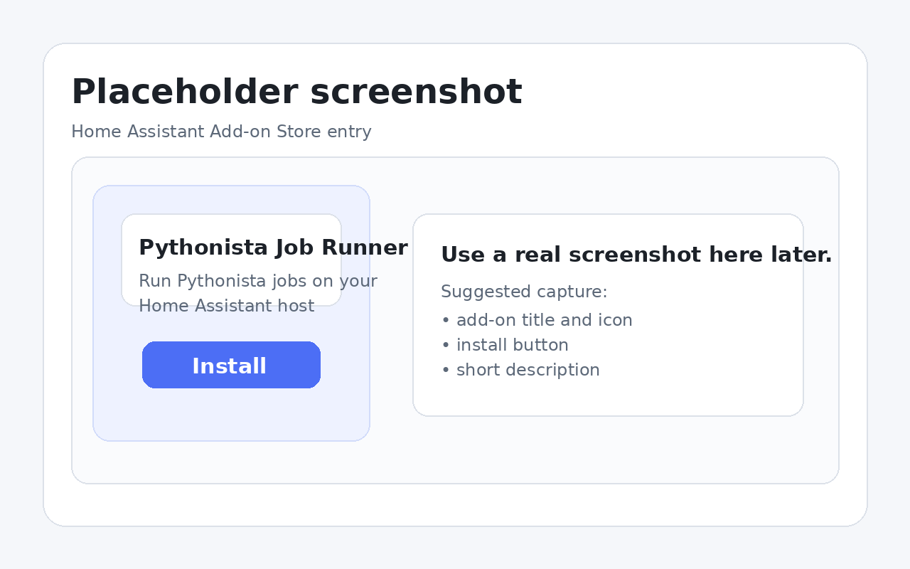
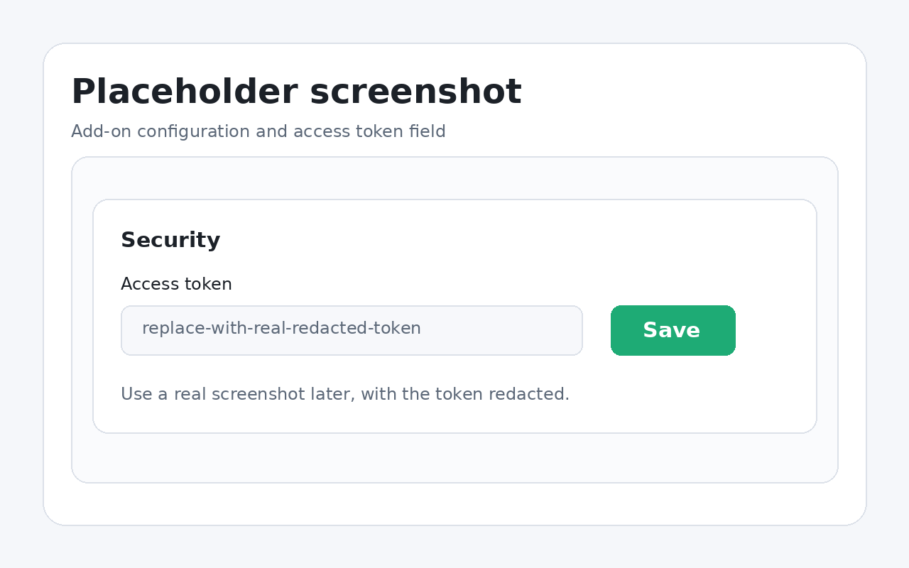
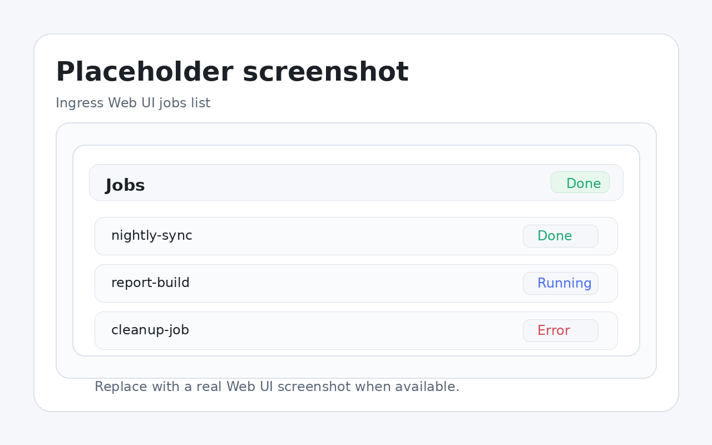
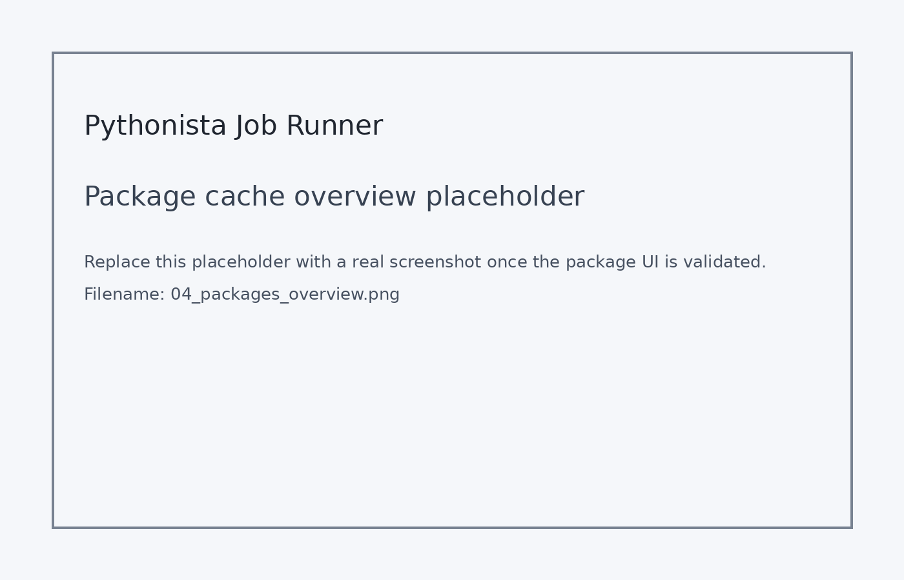
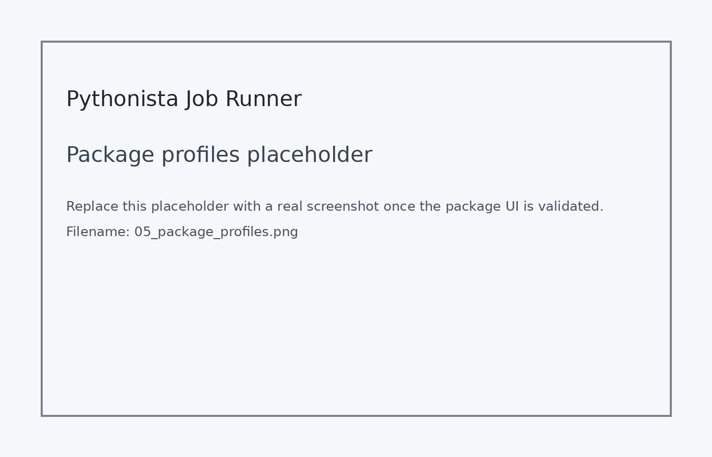

<!-- Version: 0.6.13-docs.9 -->
# Pythonista Job Runner

Run Python jobs from Pythonista on your iPhone, execute them on your Home Assistant host, and download the result zip back to the phone.

The add-on includes two ways to use it:

- **Ingress Web UI** inside Home Assistant for jobs, logs, package management, and downloads.
- **Direct HTTP API** on port `8787` for Pythonista and other scripts.

The full user guide lives in [`pythonista_job_runner/DOCS.md`](pythonista_job_runner/DOCS.md). Home Assistant shows that file in the add-on **Documentation** tab.

The add-on declares support for `amd64`, `aarch64`, and `armv7`, using Home Assistant base Python images configured in [`pythonista_job_runner/build.yaml`](pythonista_job_runner/build.yaml).

Repository truthfulness note: automated test suite in this repository executes on `amd64` CI runners. `aarch64` and `armv7` are validated at packaging and declaration level here and still need native-host smoke testing before release sign-off.

## Start here

- **I want to install it and get a first successful run**: use this page, then continue to [`pythonista_job_runner/DOCS.md`](pythonista_job_runner/DOCS.md).
- **I want the short store-facing add-on summary**: open [`pythonista_job_runner/README.md`](pythonista_job_runner/README.md).
- **I want the examples catalogue**: open [`pythonista_job_runner/examples/README.md`](pythonista_job_runner/examples/README.md).
- **I want the package-mode examples and migration notes**: open [`pythonista_job_runner/examples/packages/README.md`](pythonista_job_runner/examples/packages/README.md) and [`pythonista_job_runner/DOCS.md`](pythonista_job_runner/DOCS.md).
- **I want security guidance before exposing the API**: read [`SECURITY.md`](SECURITY.md).
- **I want release-channel guidance**: read [`docs/RELEASE_CHANNELS.md`](docs/RELEASE_CHANNELS.md).
- **I want the release-readiness checklist and upgrade validation matrix**: read [`docs/RELEASE_READINESS.md`](docs/RELEASE_READINESS.md).
- **I want to contribute**: read [`CONTRIBUTING.md`](CONTRIBUTING.md) and [`CODE_OF_CONDUCT.md`](CODE_OF_CONDUCT.md).

## One-minute install

1. In Home Assistant, go to **Settings -> Add-ons -> Add-on Store**.
2. Open the top-right menu, choose **Repositories**, then add:
   `https://github.com/WilliamRickard/ha-pythonista-job-runner`
3. Install **Pythonista Job Runner**.
4. In the add-on configuration, set a strong **Access token** and save.
5. Start the add-on.
6. Open **Open Web UI** to confirm the jobs list loads.

If you want to call the direct API from Pythonista, keep **Ingress only** off. Full setup, package-mode guidance, and security notes are in [`pythonista_job_runner/DOCS.md`](pythonista_job_runner/DOCS.md) and [`SECURITY.md`](SECURITY.md).

## Choose your access path

### Use the Web UI inside Home Assistant

Use **Open Web UI** when you want the simplest path for browsing jobs, reading logs, managing package cache and profiles, and downloading result zips from an authenticated Home Assistant session.

### Use the direct API from Pythonista

Use the direct API when your iPhone script needs to upload a job zip and handle the response itself. Direct API requests go to port `8787` and must send `X-Runner-Token`.

A minimal Pythonista upload example is in [`pythonista_job_runner/DOCS.md`](pythonista_job_runner/DOCS.md#first-run-from-pythonista).

## What a successful first run looks like

Your first good run is simple:

1. The add-on starts without errors.
2. The Web UI loads through Ingress.
3. A small job zip containing `run.py` uploads successfully.
4. The job reaches `done`.
5. The result zip contains `stdout.txt`, `stderr.txt`, `status.json`, and any files you wrote under `outputs/`.

After that, the next package-focused checks are:
- repeated `per_job` runs can reuse dependency environments
- wheelhouse imports can satisfy installs without bundling the wheel in every job zip
- profile mode can attach one named prepared environment across multiple jobs

The add-on now has a guided **Setup** flow in the Ingress Web UI for profile-mode examples. It can show readiness, upload a wheel, upload a profile zip, build or rebuild the target profile, and tell you exactly which add-on options still need a save plus restart before example 5 is truly ready. That exact flow is documented in [`pythonista_job_runner/DOCS.md`](pythonista_job_runner/DOCS.md#guided-setup-for-profile-mode-package-uploads) and exercised in [`pythonista_job_runner/examples/packages/README.md`](pythonista_job_runner/examples/packages/README.md).

## Screenshots

### Add-on Store entry

### Add-on configuration

### Ingress Web UI

### Package cache and diagnostics

### Package profiles

## Documentation map

- [`README.md`](README.md): repository landing page and fastest route to first success.
- [`pythonista_job_runner/README.md`](pythonista_job_runner/README.md): short add-on summary for store-style viewing.
- [`pythonista_job_runner/DOCS.md`](pythonista_job_runner/DOCS.md): canonical user guide, package modes, migration notes, Pythonista examples, troubleshooting, and API reference.
- [`pythonista_job_runner/examples/README.md`](pythonista_job_runner/examples/README.md): example catalogue.
- [`pythonista_job_runner/examples/packages/README.md`](pythonista_job_runner/examples/packages/README.md): package-focused examples covering cache reuse, offline wheelhouse installs, and named package profiles.
- [`SECURITY.md`](SECURITY.md): access model, trust boundaries, and safe operating guidance.
- [`docs/RELEASE_CHANNELS.md`](docs/RELEASE_CHANNELS.md): stable versus next channel guidance.
- [`docs/RELEASE_READINESS.md`](docs/RELEASE_READINESS.md): final validation checklist, upgrade notes, backup-restore checks, and release sign-off matrix.
- [`docs/screenshots/README.md`](docs/screenshots/README.md): screenshot filename contract and replacement guidance.

## Support and feedback

For usage questions, start with [`pythonista_job_runner/DOCS.md`](pythonista_job_runner/DOCS.md).

For bugs, feature requests, support questions, or docs feedback, use the GitHub issue forms in this repository.

## Development

The Web UI source files live under [`pythonista_job_runner/app/`](pythonista_job_runner/app/).

- HTML wrapper: [`pythonista_job_runner/app/webui_src.html`](pythonista_job_runner/app/webui_src.html)
- HTML partials: [`pythonista_job_runner/app/webui_html/`](pythonista_job_runner/app/webui_html/)
- CSS partials: [`pythonista_job_runner/app/webui_css/`](pythonista_job_runner/app/webui_css/)
- JavaScript parts: [`pythonista_job_runner/app/webui_js/`](pythonista_job_runner/app/webui_js/)

Rebuild and validate the bundled UI with [`pythonista_job_runner/app/webui_build.py`](pythonista_job_runner/app/webui_build.py).
